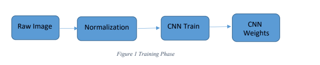
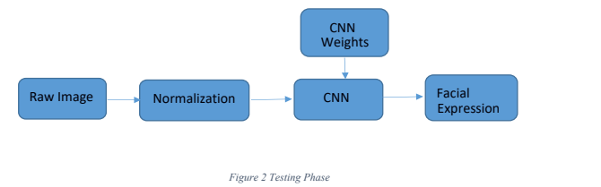
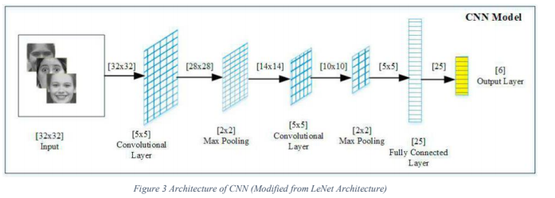
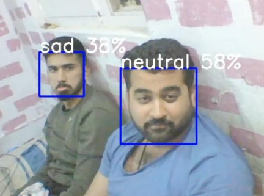

<h1 align='center'> Facial Expression Recognition Realtime</h1>
       

&nbsp &nbsp &nbsp &nbsp &nbsp Facial expression is the visible manifestation of the affective state, cognitive activity, intention, personality and psychopathology of a person and plays a communicative role in interpersonal relations. Human facial expressions can be easily classified into 7 basic emotions: happy, sad, surprise, fear, anger, disgust, and neutral. Our facial emotions are expressed through the activation of specific sets of facial muscles. These sometimes subtle, yet complex, signals in expression often contain an abundant amount of information about our state of mind.

<h2><u> Problem Defination </u></h2>

&nbsp &nbsp &nbsp &nbsp &nbsp Human emotions and intentions are expressed through facial expressions and deriving an efficient and effective feature is the fundamental component of the facial expression system. Facial expressions convey non-verbal cues, which play an important role in interpersonal relations. Automatic recognition of facial expressions can be an important component of natural humanmachine interfaces; it may also be used in behavioral science and in clinical practice. An automatic Facial Expression Recognition system needs to solve the following problems: detection and location of faces in a cluttered scene, facial feature extraction, and facial expression classification.

<h2><u>Objective</u></h2>

&nbsp &nbsp &nbsp &nbsp &nbsp To implement Convolutional Neural Networks for the classification of facial expressions.

<h2><u>Methodology </u></h2>

<h2><u>Dataset</u></h2>

&nbsp &nbsp &nbsp &nbsp &nbsp The dataset from a Kaggle Facial Expression Recognition Challenge (FER2013) is used for the training and testing. It comprises pre-cropped, 48-by-48-pixel grayscale images of faces each labeled with one of the 7 emotion classes: anger, disgust, fear, happiness, sadness, surprise, and neutral. Dataset has a training set of 35887 facial images with facial expression labels. The dataset has a class imbalance issue since some classes have a large number of examples while some have few. The dataset is balanced using oversampling, by increasing numbers in minority classes. The balanced dataset contains 40263 images, from which 29263 images are used for training, 6000 images are used for testing, and 5000 images are used for validation.

<h2><u> Architecture of CNN </u></h2>

&nbsp &nbsp &nbsp &nbsp &nbsp A typical architecture of a convolutional neural network contains an input layer, some convolutional layers, some fully-connected layers, and an output layer. CNN is designed with some modifications to LeNet Architecture . It has 6 layers without considering input and output. The architecture of the Convolution Neural Network used in the project is shown in the following figure.

<h2><u> Results and Analysis </u></h2>

&nbsp &nbsp &nbsp &nbsp &nbsp CNN architecture for facial expression recognition as mentioned above was implemented in Python. Along with Python programming language, Numpy, Keras and TensorFlow libraries were used.

&nbsp &nbsp &nbsp &nbsp &nbsp The training image batch size was taken as 30, while the filter map is of size 20x5x5 for both the convolution layer. The validation set was used to validate the training process. In the last batch of every epoch invalidation cost, validation error, training cost, training error are calculated. Input parameters for training are image set and corresponding output labels. The training process updated the weights of feature maps and hidden layers based on hyper-parameters such as learning rate, momentum, regularization, and decay.

<h2><u>Realtime Evaluation</u></h2>

The following is an image while testing in real-time 

<h2><u> References </u></h2>
[1] Shan, C., Gong, S., & McOwan, P. W. (2005, September). Robust facial expression recognition using local binary patterns. In Image Processing, 2005. ICIP 2005. IEEE International Conference on (Vol. 2, pp. II-370). IEEE.
 
[2] Chibelushi, C. C., & Bourel, F. (2003). Facial expression recognition: A brief tutorial overview. CVonline: On-Line Compendium of Computer Vision, 9. 
[3] "Convolutional Neural Networks (LeNet) – DeepLearning 0.1 documentation". DeepLearning 0.1. LISA Lab. Retrieved 31 August 2013. 
[4] Matusugu, Masakazu; Katsuhiko Mori; Yusuke Mitari; Yuji Kaneda (2003). "Subject independent facial expression recognition with robust face detection using a convolutional neural network" (PDF). Neural Networks. 16 (5): 555–559. DOI:10.1016/S0893-6080(03)00115-1. Retrieved 17 November 2013. 
[5] LeCun, Yann. "LeNet-5, convolutional neural networks". Retrieved 16 November 2013 
[6] C. Zor, “Facial expression recognition,” Master’s thesis, University of Surrey, Guildford, 2008. 
[7] Suwa, M.; Sugie N. and Fujimora K. A Preliminary Note on Pattern Recognition of Human Emotional Expression, Proc. International Joint Conf, Pattern Recognition, pages 408-410, 1978 
[8] Recognizing action units for facial expression analysis YI Tian, T Kanade, JF Cohn IEEE Transactions on pattern analysis and machine intelligence 23 (2), 97115 
[9] Raghuvanshi, Arushi, and Vivek Choksi. "Facial Expression Recognition with Convolutional Neural Networks." Stanford University, 2016 
[10] Alizadeh, Shima, and Azar Fazel. "Convolutional Neural Networks for Facial Expression Recognition." Stanford University, 2016 
[11] Krizhevsky, Alex, Ilya Sutskever, and Geoffrey E. Hinton. ”Imagenet classification with deep convolutional neural networks.” Advances in neural information processing systems. 2012. 
[12] Simonyan, Karen, and Andrew Zisserman. ”Very deep convolutional networks for largescale image recognition.” arXiv preprint arXiv:1409.1556 (2014).  

<h2><u>Note: </u></h2>

 If you need any kind of help contact me at  <a href='https://https://pk.linkedin.com/in/monisaliqureshi'>LinkedIn</a>
| <a href='https://www.facebook.com/monisaliqureshi'>Facebook</a>

